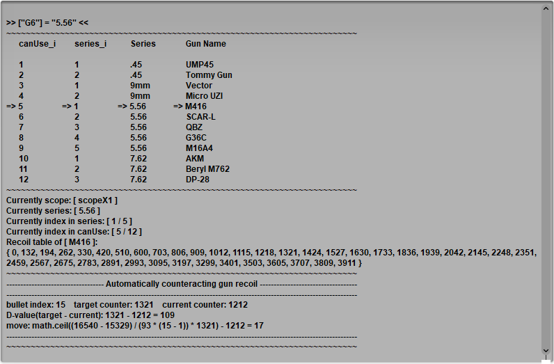

<!-- # Soldier76  -->

<!-- PUBG - G502鼠标宏自动压枪脚本使用说明 -->

<!-- ***(务必...务必...务必...认真看完，使用说明写的很详细了)*** -->

<div align="center">
  
</div>
<h1 align="center">
  Soldier76 | <a href="./README-LITE.md">Lite</a>
</h1>
<div align="center">PUBG - Logitech鼠标宏自动压枪脚本使用说明</div>
<div align="center"><b>(务必...务必...务必...认真看完，使用说明写的很详细了)</b></div>
<div align="center">如果认为游戏体验有提升的话，请给我一颗小星星⭐</div>
<br>
<p align="center">
  
  
  
  
</p>
<!--     -->

---

<p align="right">
  Other Languages: 
  <a href="./README.en.md">English</a>
</p>

### 下载脚本
* 选择一个版本然后[下载](https://github.com/kiccer/Soldier76/releases)，国内玩家推荐使用[镜像下载](https://gitee.com/kiccer/Soldier76/tags)
* 如果使用镜像下载，请注意版本号是否和github上一致，镜像项目由于需要手动同步进行更新，所以不一定是最新版本。

### 安装教程
* **以管理员身份**启动罗技驱动
  - 请确保你下载的驱动与你的操作系统是匹配的
  - 目前暂不支持 `GHUB` 新驱动，相关信息请到[讨论区](https://github.com/kiccer/Soldier76/discussions/118)了解。
* 开启 **自动游戏检测**
  - 这样做的好处是，可以避免脚本意外干扰正常操作
  - 尽量不要锁定配置，因为锁定后你的脚本无时无刻都是运行的，可能会干扰你的鼠标正常使用
* 扫描游戏
  - 如果自动检测无法找到游戏，则需要手动添加
  - 手动添加的窍门是，打开任务管理器，找到游戏进程，右键选择打开文件所在位置，即可找到需要添加的文件
* 右键配置文件右侧 **PUBG** 图标 -> **编写脚本**
  - 上一步之后，会多出来的一个pubg图标，右键这个图标就能找到 **编写脚本** 了
* 将 **Soldier76.lua** 中包含的所有代码完全 **覆盖** 进去，保存(Ctrl + S)
  - 覆盖，即打开 **编写脚本** 时，不保留初始生成的代码
  - 注意不要使用翻译软件翻译脚本，翻译软件会破坏代码格式，导致报错
* 右键 **PUBG配置** 和 **默认配置** 中的 **G6**, **G7**, **G8**, **G9**, **G10**, **G11** 等按钮 -> **取消分配**
  - 当前配置和默认配置中按键绑定的板载宏都有可能会干扰到脚本的正常使用，所以应该 **取消分配**

### 游戏设置
* **脚本默认** 设置 `AimingSettings = "recommend"` ，即脚本推荐设置，需要对游戏内设置做相应改动
  - 开镜：**长按** 右键
  - 瞄准：当 `autoPressAimKey = ""` 时，**长按** `ctrl` 键
* 如果习惯 **游戏默认** 设置，则设置 `AimingSettings = "default"` ，那么你就可以不需要改任何游戏设置
  - 使用该设置，你的任何点击操作都会被识别为射击，并且会触发自动压枪
  - 如果你只是单纯的想要进行点击操作，则需关闭脚本，或者暂时按住左shift或者左alt也是可以的
* 如果你的操作习惯比较与众不同，也可以 **自定义** 设置 `AimingSettings = "custom"`
  - 使用该设置需要在 `customAimingSettings` 中做对应的判断
  - 建议对该脚本有一定认识后再使用，或者可以加入交流群获取帮助
* 最新版脚本增加 **自动腰射** 功能，设置 `autoPressAimKey = "tilde"` 开启
  - 需要设置为键盘上的按键，按键名请查询 **G-series Lua API 参考文档.docx**
  - 如需关闭，请设置 `autoPressAimKey = ""`
  - 该功能不兼容 `AimingSettings = "default"`
  - 默认兼容 `AimingSettings = "recommend"`,但是会影响普通点击操作，需要点击操作时请关闭脚本，或者暂时按住左shift或左alt键
  - 兼容 `AimingSettings = "custom"` ，需要自己做好兼容设置

参数 | 描述
:--: | ---
`default` | 使用游戏初始默认的设置，即点击右键开镜，长按右键瞄准。(单纯点击操作时需要按住左shift)
`recommend` | 使用此脚本推荐设置，即长按右键开镜，长按左ctrl瞄准。(脚本默认使用该设置)
`ctrlmode` | 此模式需要修改游戏设置为快速开镜，ctrl按住时为蹲下。(此模式没有腰射)
`custom` | 自定义设置，使用在 `customAimingSettings` 中设置的判断条件。

### 启动控制
> 修改 `startControl = "capslock"` 可以使用不同的方式控制宏开启(关闭)

参数 | 描述
:--: | ---
`capslock` | 使用大写锁定键控制。(默认，推荐)
`numlock` | 小键盘锁定键控制。
`G_bind` | 使用 `off` 指令关闭宏，任何切换枪支操作都能够开启宏。

### 模式控制
按键 | 功能
:--: | ---
**CapsLock** | 开启大写字母键，启动宏，关闭则锁定宏，关闭时不会响应左键执行压枪操作，但 `G_bind` 指令依然有效(注：可改为其他控制方式，详见[#启动控制](https://github.com/kiccer/Soldier76#%E5%90%AF%E5%8A%A8%E6%8E%A7%E5%88%B6))
**ScrollLock** | 开启开发者调试模式，准星自动向右拉(开启后尝试修改 `ADS` 的值，使弹道变成一字)

### 初次使用
1. 按照 [#安装教程](https://github.com/kiccer/Soldier76#%E5%AE%89%E8%A3%85%E6%95%99%E7%A8%8B) 安装脚本
1. 然后再更改游戏内设置，参考 [#游戏设置](https://github.com/kiccer/Soldier76#%E6%B8%B8%E6%88%8F%E8%AE%BE%E7%BD%AE)
1. 修改脚本 `canUse` 中的枪械，设置 `UMP45` 的模式为 **1**，其他枪械的模式全部设置为 **0**。(**自动游戏检测时，切换窗口会导致脚本重启，因此不会记录上一次配置表的位置信息，将可用枪械限制为1个有利于调试，你也可以选择保留其他的枪，任何一把枪都可以。**)
1. 进入训练场，按照注释提示，给枪支安装指定配件。
1. 开启压枪功能(启动方式参考 `startControl` )和调试模式 `ScrollLock` ，面对墙壁，**按住**右键开镜，**按住左键**开火，你会发现**准星自动往右偏移**，请不要移动鼠标，直到子弹打光。
1. 如果弹印不是一条水平线，则修改 `ADS` 的数值，上下微调即可。
1. 回到游戏感受弹道变化，重复以上修改操作，继续尝试，直到弹道变成一条水平线为止。
1. 如果数值无论怎么修改都无法变成一条水平线，请尝试略微调整游戏内的鼠标灵敏度。
1. 当弹道成功打成一条水平线时，关闭调试模式 `ScrollLock`，然后再次对着墙壁进行射击。如果没有意外，那么恭喜你，你的宏已经能够准确的自动压枪了！
1. 微调 `Aim` 、 `scopeX2` 、 `scopeX3` 、 `scopeX4` 、 `scopeX6` 的值，使腰射、二倍、三倍、四倍、六倍压枪时弹印集中于一处。不需要倍镜压枪功能的可以跳过此步。
1. 修改脚本 `canUse` 中的枪械，将你需要的枪械设置为模式 **1**
1. `ctrl+s` 保存脚本后，可以在编辑器里尝试切换配置，切换配置时会有对应的文本信息输出，你可以在这里确认是否和心里预期的配置信息相同。
1. 最后一步，寻找队友，然后尽情装逼吧~

<p style="color: red; font-weight: bold;">* 注意代码中的注释，已经明确标出了玩家自定义区域，和脚本核心区域，请不要修改脚本核心区域中的代码。</p>

### 其他设置(非必要)
* 连点功能请在 `canUse` 中设置
* 独立系数请在 `canUse` 中设置
* 独立下蹲系数请在 `canUse` 中设置
* [扩展开发教程：增加一把新的枪械/修改一把枪械的数据](https://github.com/kiccer/Soldier76/issues/24)
* [扩展开发教程：设置自定义瞄准判断条件](https://github.com/kiccer/Soldier76/issues/52)

### 什么是切换配置？
很多人没搞清楚切换是什么意思，这是我们脚本与众不同的地方。

这个脚本中有一个枪械库，枪械库根据子弹类型分成不同系列，包括： **.45** 系列、 **9mm** 系列、 **5.56** 系列和 **7.62** 系列。每个系列下存放着匹配弹药类型的枪械，比如5.56系列下的第一把枪就是 **M416** 。 **G6-G9** 一共4个键，每个键即代表一个系列，单击后将切换至对应系列的枪械表，并且自动选中列表中的第一把枪。多次按G11键可以向下选择枪支，如果你需要的是该系列中的最后一把枪，只需按一次G10即可。

举个例子：你捡到了一把 **AKM** ，你只需要点击一下 **G8** 键，就可以了，因为 **AKM** 就是 **7.62** 系列中的第一把枪。如果你又捡到了一把 **QBZ** ，你不要你的 **AKM** 了，这时你需要先点击一次 **G6** ，切换到 **5.56** 系列时默认选中了第一把枪，而 **QBZ** 是第三个，所以你还要再按2次 **G11** ，这样你才能使用 **QBZ** 的数据。

枪械顺序请查看源代码中的 `userInfo.canUse`，排列顺序即枪械顺序。

以上G键功能都可以自定义设置，默认为g502设置，其他logitech系列可编程鼠标也全都支持。如果自己不会设置和调整，欢迎加群向我们询问。



### G键功能(默认设置)
G键 | 功能
:--: | ---
`G6` | 切换至 **5.56** 枪械配置文件表，并使用**第一个**配置
`G7` | 切换至 **9mm** 枪械配置文件表，并使用**第一个**配置
`G8` | 切换至 **7.62** 枪械配置文件表，并使用**第一个**配置
`G9` | 切换至 **.45** 枪械配置文件表，并使用**第一个**配置
`G10` | 切换至**最后一个**配置 (滚轮右偏)
`G11` | 切换至**下一个**配置 (滚轮左偏)

[//]: # (以下内容已注释)
[//]: # (`lalt` + `G6` | 切换至基瞄压枪模式)
[//]: # (`lalt` + `G7` | 切换至三倍镜压枪模式)
[//]: # (`lalt` + `G8` | 切换至四倍镜压枪模式)
[//]: # (`lalt` + `G9` | 切换至二倍镜压枪模式)
[//]: # (`lalt` + `G11` | 切换至六倍镜压枪模式)

> 以上设置均可在 `G_bind` 中自定义修改键位

### 指令列表
指令 | 功能
:--: | ---
`.45` | 切换至 **.45** 系列枪械列表，并使用该列表下的第一把枪
`9mm` | 切换至 **9mm** 系列枪械列表，并使用该列表下的第一把枪
`5.56` | 切换至 **5.56** 系列枪械列表，并使用该列表下的第一把枪
`7.62` | 切换至 **7.62** 系列枪械列表，并使用该列表下的第一把枪
`first` | 切换至当前列表的第一把枪
`next` | 切换至当前列表的下一把枪
`last` | 切换至当前列表的最后一把枪
`first_in_canUse` | 将 `canUse` 下所有可用枪械视为一整个列表，并切换至该列表的第一把枪
`next_in_canUse` | 将 `canUse` 下所有可用枪械视为一整个列表，并切换至该列表的下一把枪
`last_in_canUse` | 将 `canUse` 下所有可用枪械视为一整个列表，并切换至该列表的最后一把枪
`off` | 当 `startControl = "G_bind"` 时，使用指令控制脚本关闭，切换枪支操作会重新启动宏
`scopeX1` | 切换为基瞄模式 (红点、全息、侧瞄或不用任何瞄具)
`scopeX2` | 切换为二倍镜模式
`scopeX3` | 切换为三倍镜模式
`scopeX4` | 切换为四倍镜模式
`scopeX6` | 切换为六倍镜模式
`UMP45` | 直接切换至 `UMP45` 配置
`Tommy Gun` | 直接切换至 `Tommy Gun` 配置
`Vector` | 直接切换至 `Vector` 配置
`Micro UZI` | 直接切换至 `Micro UZI` 配置
`M416` | 直接切换至 `M416` 配置
`SCAR-L` | 直接切换至 `SCAR-L` 配置
`QBZ` | 直接切换至 `QBZ` 配置
`G36C` | 直接切换至 `G36C` 配置
`M16A4` | 直接切换至 `M16A4` 配置
`AKM` | 直接切换至 `AKM` 配置
`Beryl M762` | 直接切换至 `Beryl M762` 配置
`DP-28` | 直接切换至 `DP-28` 配置
`fast_pickup` | 一键拾取(关闭背包后使用) **群友反馈此功能被蓝洞和谐，极容易三天，慎用！**
`fast_discard` | 一键丢弃(关闭背包后使用)
`fast_lick_box` | 一键舔包(关闭背包后使用，仅拾取可以装入背包的物品)

> 可以绑定至 `G_bind` ，使用预设的组合键触发指令。
>
> 注意：是指令绑定到组合键上，而不是组合键绑定到指令。请不要修改等号前面`[""]`中的内容！
>
> 注意：**一键拾取/一键丢弃/一键舔包**均有三天可能，慎用！目前对这三个功能做了一些实验性更新，不保证安全！

### `G_bind` 指令绑定演示
```lua
-- G
["G3"] = "",
["G4"] = "",
["G5"] = "",
["G6"] = "5.56",
["G7"] = "9mm",
["G8"] = "7.62",
["G9"] = ".45",
["G10"] = "last",
["G11"] = "next",

-- ✖，错误的修改方式
["G3"] = "",
["G4"] = "", -- 下面的 G4 会覆盖这个 G4，丢失了 G6 ，按下 G6 会出错。
["G5"] = "",
["G4"] = "5.56", -- 绝对不可以直接修改等号前面的组合键！
["G7"] = "9mm",
["G8"] = "7.62",
["G9"] = ".45",
["G10"] = "last",
["G11"] = "next",

-- ✔，正确的修改方式
["G3"] = "",
["G4"] = "5.56", -- 把指令绑定到了这里
["G5"] = "",
["G6"] = "", -- 清空了这个指令
["G7"] = "9mm",
["G8"] = "7.62",
["G9"] = ".45",
["G10"] = "last",
["G11"] = "next",

-- v4.4 版本新增支持绑定一组指令，使用 | 分隔
["rctrl + G5"] = "M416|scopeX1",
["rctrl + G6"] = "AKM|scopeX4",
```

### 硬件条件
* 一只可编程 Logitech 鼠标（无线鼠标运行宏时很不稳定）
* 游戏画面不卡顿，不频繁掉帧，必要时可以锁定帧数保证稳定性

### 免责声明
* **该脚本程序仅供学习交流，严禁使用于任何商业用途，若产生利益纠纷，概不负责。**
* **请尊重作者的劳动成果，如需转载，请注明出处，谢谢！**
* **不可将此脚本二次创作后用于商业目的！**

### 交流群
* 欢迎加入技术交流QQ群（**以下为指定官方群，其余均为冒名假群！谨防受骗！**）：
  - [768483124](https://kiccer.github.io/Soldier76/static/join_group.html) (刚清理了一波尸体，要加的赶紧！)
  - *若暂时群满无法加入，请先移步至[讨论区](https://github.com/kiccer/Soldier76/discussions)，待新群建立后再加入！*
* 十分欢迎愿意给本项目精调弹道的小伙伴
* 我们也同样欢迎其他项目的小伙伴入驻，一起交流技术话题
* 群内活动：
  - 在任意知名论坛内发表 [Soldier76](https://github.com/kiccer/Soldier76) 宏推广文章，可以获得个人专属昵称，领取页面：[【活动】个人专属昵称获取专区](https://github.com/kiccer/Soldier76/discussions/131)
  - 举报二手贩子可以获得 `夹击妹抖` 专属昵称，领取页面：[【活动】专属昵称 “夹击妹抖” 获取专区](https://github.com/kiccer/Soldier76/discussions/128)
  - 点赞 [Soldier76](https://github.com/kiccer/Soldier76) 项目，可以获得 `⭐` 专属昵称，领取页面：[【活动】专属昵称 ⭐ 获取专区](https://github.com/kiccer/Soldier76/discussions/126)
  - *满足以上多条情况，可以任选其一。*

### 常见问题
* Q：毫无反应？
  - A1：请先排除无线鼠标、GHUB
  - A2：请确认你是否启动了宏 (默认为开启大写)

* Q：在桌面有反应，在游戏里没反应？
  - A：关闭驱动，重新以管理员身份启动驱动

* Q：代码中的注释全是乱码？
  - A1：你的驱动可能是 `GHUB`，目前暂时不支持
  - A2：你可能使用了 `导入`功能，`lua` 文件是直接复制粘贴进编辑器里的，不能使用 `导入`

* Q：代码复制进编辑器后，保存就报错？
  - A1：不支持 GHUB
  - A2：确认是否是从官网获取的代码

* Q：枪头直接怼地上，拉都拉不起来？
  - A：调整 ADS (如果你有此疑问，你肯定没看上面的教程)

* Q：加群问题答案是什么？
  - A：抱歉，无可奉告！这个加群问题就是为了不让没看过文档的人加群，防止他们在群里提一些毫无营养的问题。只要是认真看过一遍文档的人，都可以找到加群答案的！(ps: 天天回答一些重复问题是很麻烦的，有这回答时间我还不如把文档写写详细一点。)

* Q：怎么区分满配和裸配？
  - A1：首先说我的观点，我不推荐为裸配和满配单独区分配置，如果进行区分，那还需要手动切换设置，操作更麻烦。推荐设置满配系数，游戏中如果没有搜到补偿器，就用蹲姿射击。蹲姿减后座的效果等于补偿器。推荐三角握把，因为它只控制水平后坐力，不影响垂直后坐力，如果是其他握把可能会出现压过头的情况。（具体看个人习惯）
  - A2：如果你非要区分满配裸配，那么你可以把代码中 `scopeX2`、`scopeX3`、`scopeX4`、`scopeX6` 随便一个当做裸配系数就可以实现了。（一般情况下你也不需要这么多倍镜系数，舍弃一个你不用的倍镜系数当做裸配系数用就可以了。）

### 问题反馈
* 使用脚本时有任何疑问，或脚本存在不足之处可以在 [`Issues`](https://github.com/kiccer/Soldier76/issues) 反馈给我

### 关于宏
宏就像是一个心灵手巧的瞎子,它能帮你做更复杂细腻的操作,但无法根据实时情况进行变通,所以菜的人依旧菜得真实……

### 关于游戏公平性问题
我赞同 [@liantian-cn](https://github.com/liantian-cn/logitech-pubg/tree/f816d1da3e2d5cf82708bf4225b4cf3f03c06332#q2-%E6%80%8E%E4%B9%88%E7%9C%8B%E5%BE%85%E9%BC%A0%E6%A0%87%E5%AE%8F) 的观点。

用4000块的显示器打赢显示器是400块的对手，有人说不公平吗？用一万块的显卡打赢显卡是一千块的对手，有人说不公平吗？为什么用几百块的鼠标打赢鼠标是几十块的对手，就有人要说是不公平，是作弊呢？

明明好的显示器和好的显卡对游戏水平的影响比一个鼠标宏要大的多，为什么偏偏认为是鼠标宏不公平？

杠精会说，你可以用几百块的鼠标，鼠标给你提供了宏的功能，但是你有权不使用。那么我也可以说，4000块的显示器给了你144Hz以及2K甚至4K的显示分辨率，你也有权不使用，你可以改回60Hz和1080p，显卡也是一样。

出于一些人的偏见，我不得不说清楚这些。鼠标宏无罪，菜是原罪。认为别人使用鼠标宏破坏了你的游戏体验的人，请你们尝试过了鼠标宏之后再来回答。它没你们臆想的那么神。

**鼠标宏只是你学自行车时的辅助轮**，在你学会了之后只会想把它拆掉，就这么简单。

### Need help
My English is not very good, and the translation results of translation software are usually very strange. So I need a translator to help me translate this document into other languages. If you can, please contact me.

If you could directly `fork` the project and create a `README.[lang].md`, then `Pull Request` would be great for me.

<!-- ~~Ps: 如果认为游戏体验有提升的话，请给我一颗小星星:)~~ -->
